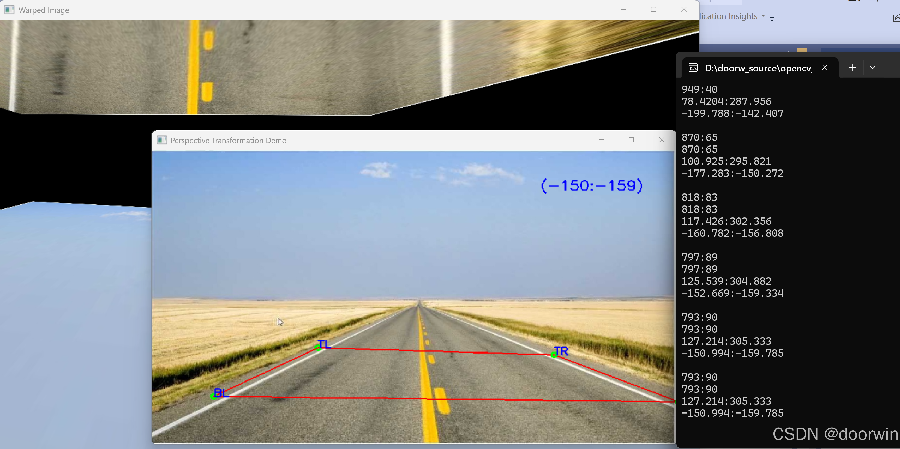

# opencv坐标变换
##1.功能描述
实现可视化的图片坐标到真实坐标的转换。 鼠标经过图片各个区域，可以实时显示转变之后的坐标值。
可以直观看到转变之后的图片效果。

##2.使用方法:
输入一个图片或者视频截图，选定四个点，用于真实坐标转换。

热键说明：

Hot keys:
        ESC, q - quit the program
        r - change order of points to rotate transformation
        c - delete selected points
        i - change order of points to inverse transformation

##3.效果图：

CMakeLists代码

cmake_minimum_required(VERSION 3.5)
 
project(warpPerspective LANGUAGES CXX)
 
set(CMAKE_CXX_STANDARD 11)
set(CMAKE_CXX_STANDARD_REQUIRED ON)
 
find_package(OpenCV 4 REQUIRED )
 
include_directories(
    ${OpenCV_INCLUDE_DIRS}/include
    )
message(STATUS "-OpenCV_INCLUDE_DIRS--- = ${OpenCV_INCLUDE_DIRS}/include")
# -------------- Compile CUDA for FP16 inference if needed  ------------------#
option(USE_CUDA "Enable CUDA support" ON)
if (NOT APPLE AND USE_CUDA)
    find_package(CUDA REQUIRED)
    include_directories(${CUDA_INCLUDE_DIRS})
    add_definitions(-DUSE_CUDA)
else ()
    set(USE_CUDA OFF)
endif ()
 
add_executable(OpencvWarp
 
    main.cpp
)
target_link_libraries(OpencvWarp PRIVATE  ${OpenCV_LIBS} )

##5.编译方法
根据本地环境，修改CMakeLists.txt，

windows环境，代码目录创建build目录，cd进入build目录，执行cmake..，生成visula studio工程。

测试环境Opencv4.10.0

如果没有显卡，设置option(USE_CUDA "Enable CUDA support" ON) ，ON改为OFF

背景图片，和main.c放到同一目录。

视频讲解链接：【opencv坐标变换】 https://www.bilibili.com/video/BV1pYAPemEED/?share_source=copy_web&vd_source=a826e76e6abda91b5e93accaf4bd3623
